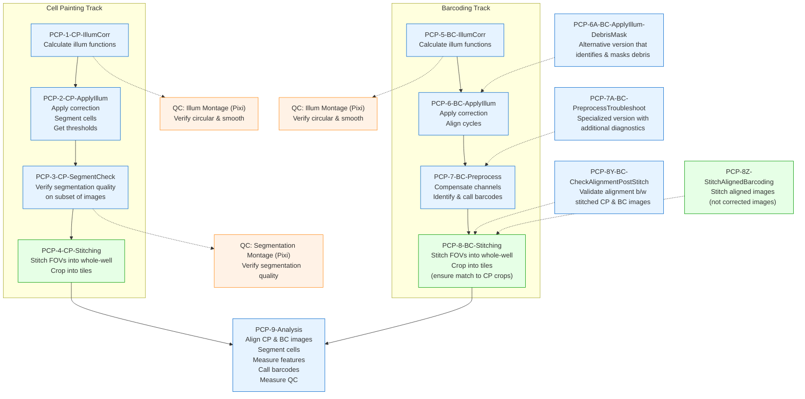

# PCPIP Docker Demo

Containerized PCPIP (Pooled Cell Painting Image Processing) pipeline demo using CellProfiler and Fiji.

## Pipeline Architecture

This pipeline uses three specialized Docker containers:
- **cellprofiler**: Runs CellProfiler pipelines (1-3, 5-7, 9)
- **fiji**: Runs ImageJ/Fiji stitching (4, 8)
- **qc**: Runs QC visualizations with Pixi (1_qc_illum, 5_qc_illum)

Each container is called with `PIPELINE_STEP` to specify what to run.

## Quick Start

### Prerequisites
- Docker Desktop with **16GB memory** for Pipeline 9 (Settings → Resources → Advanced)
- Git installed
- Optional: [Pixi](https://pixi.sh) for running QC scripts locally

### Setup & Run

```bash
# Run all commands from the pcpip/ directory
cd pcpip/

# 1. Clone plugins
git clone https://github.com/CellProfiler/CellProfiler-plugins.git plugins/

# 2. Get test data (~3GB)
aws s3 sync s3://nf-pooled-cellpainting-sandbox/data/test-data/fix-s1/ data/ --no-sign-request

# 3. (Optional) Crop images for faster processing
# Overwrites originals - re-download from S3 to restore
# Options: 25 (fastest), 50 (balanced), 75 (conservative)
CROP_PERCENT=25 docker-compose run --rm cellprofiler python3 /app/scripts/crop_preprocess.py

# 4. Run complete workflow with QC
# Note: Stitching steps use CROP_PERCENT to adjust tile dimensions - use the same value as above!
PIPELINE_STEP=1 docker-compose run --rm cellprofiler
PIPELINE_STEP=1_qc_illum docker-compose run --rm qc
PIPELINE_STEP="2,3" docker-compose run --rm cellprofiler
PIPELINE_STEP=3_qc_seg docker-compose run --rm qc
CROP_PERCENT=25 PIPELINE_STEP=4 docker-compose run --rm fiji

PIPELINE_STEP=5 docker-compose run --rm cellprofiler
PIPELINE_STEP=5_qc_illum docker-compose run --rm qc
PIPELINE_STEP="6,7" docker-compose run --rm cellprofiler
CROP_PERCENT=25 PIPELINE_STEP=8 docker-compose run --rm fiji

PIPELINE_STEP=9 docker-compose run --rm cellprofiler
```

<details>
<summary>Pipeline Details</summary>




</details>

## Reference

### Directory Structure

```
pcpip/
├── pipelines/                             # CellProfiler pipeline files (.cppipe)
├── plugins/                               # CellProfiler plugins (cloned separately)
├── scripts/                               # Processing scripts and utilities
│   ├── run_pcpip.sh                       # Main pipeline orchestration script
│   ├── stitch_crop.py                     # ImageJ/Fiji stitching and cropping
│   ├── qc_illum_montage.py                # QC visualization for illumination functions
│   ├── transform_pipeline3_csv.py         # CSV transformation for segmentation QC (skip pattern + plate nesting)
│   ├── transform_pipeline7_csv.py         # CSV transformation for plate nesting from pipeline 6
│   ├── transform_pipeline9_csv.py         # CSV transformation for cropped tiles
│   └── check_csv_files.py                 # File validation utility
├── data/                                  # Unified data directory
│   └── Source1/Batch1/
│       ├── illum/                         # Illumination correction functions
│       ├── images_corrected/              # Corrected images
│       ├── images_aligned/                # Aligned barcoding images
│       ├── images_corrected_stitched/     # Stitched whole-well images
│       ├── images_corrected_cropped/      # Cropped tile images
│       └── qc_reports/                    # QC visualization outputs
└── docker-compose.yml                     # Container configuration
```


### Quality Control (QC)

The pipeline includes automatic QC checks after key processing steps. These checks help verify that illumination correction functions appear "vaguely circular and vaguely smooth" as expected.

#### Running QC Steps

QC steps are treated as standalone pipeline steps, just like stitching:

```bash
# Run QC after Pipeline 1
PIPELINE_STEP=1_qc_illum docker-compose run --rm qc

# Run QC after Pipeline 5
PIPELINE_STEP=5_qc_illum docker-compose run --rm qc

# Run locally with Pixi (if installed)
./scripts/qc_illum_montage.py \
  data/Source1/Batch1/illum/Plate1 \
  data/Source1/Batch1/qc_reports/1_illumination_cp/Plate1/montage.png \
  painting Plate1

# Custom channels and cycles
./scripts/qc_illum_montage.py \
  data/Source1/Batch1/illum/Plate1 \
  output.png barcoding Plate1 \
  --cycles 1-2 --channels DNA,A,C

# Interactive QC shell
docker-compose run --rm qc-shell
# Then inside container:
./qc_illum_montage.py /app/data/Source1/Batch1/illum/Plate1 /app/data/test.png painting Plate1
```

#### QC Options

- `--channels`: Specify channels to include (e.g., `DNA,Phalloidin`)
- `--cycles`: Specify cycles for barcoding (e.g., `1-3` or `1,3,5`)
- `--verbose/-v`: Enable detailed logging
- Set `RUN_QC=false` environment variable to skip automatic QC

### Troubleshooting

### Pipeline 9 Memory Issues

- Requires Docker Desktop with 16GB+ memory allocation
- If still failing, increase to 24GB or 32GB

### Debug Commands

```bash
# Check logs
ls data/logs/*/
tail data/logs/*/pipeline*.log

# Interactive shells
docker-compose run --rm cellprofiler-shell
docker-compose run --rm fiji-shell

# Cleanup outputs
rm -rf data/Source1/Batch1/{illum,images_aligned,images_corrected*}
```

```bash
# Test single well stitching and cropping

docker compose run --rm \
  -e STITCH_INPUT_BASE="/app/data/Source1/Batch1" \
  -e STITCH_TRACK_TYPE="painting" \
  -e STITCH_OUTPUT_TAG="Plate1-A1" \
  -e STITCH_CHANNEL="DNA" \
  -e STITCH_AUTORUN="true" \
  fiji /opt/fiji/Fiji.app/ImageJ-linux64 --ij2 --headless --run /app/scripts/stitch_crop.py > /tmp/stitch_crop_painting_Plate1_A1.log 2>&1

grep "Saving /app/data/" /tmp/stitch_crop_painting_Plate1_A1.log
# INFO - Saving /app/data/Source1/Batch1/images_corrected_stitched/painting/Plate1-A1/Stitched_CorrCHN2.tiff, width=5920, height=5920
# INFO - Saving /app/data/Source1/Batch1/images_corrected_cropped/painting/Plate1-A1/CorrCHN2/CorrCHN2_Site_1.tiff, width=2960, height=2960
# INFO - Saving /app/data/Source1/Batch1/images_corrected_cropped/painting/Plate1-A1/CorrCHN2/CorrCHN2_Site_2.tiff, width=2960, height=2960
# INFO - Saving /app/data/Source1/Batch1/images_corrected_cropped/painting/Plate1-A1/CorrCHN2/CorrCHN2_Site_3.tiff, width=2960, height=2960
# INFO - Saving /app/data/Source1/Batch1/images_corrected_cropped/painting/Plate1-A1/CorrCHN2/CorrCHN2_Site_4.tiff, width=2960, height=2960
# INFO - Saving /app/data/Source1/Batch1/images_corrected_stitched_10X/painting/Plate1-A1/Stitched_CorrCHN2.tiff, width=592, height=592
# INFO - Saving /app/data/Source1/Batch1/images_corrected_stitched/painting/Plate1-A1/Stitched_CorrDNA.tiff, width=5920, height=5920
# INFO - Saving /app/data/Source1/Batch1/images_corrected_cropped/painting/Plate1-A1/CorrDNA/CorrDNA_Site_1.tiff, width=2960, height=2960
# INFO - Saving /app/data/Source1/Batch1/images_corrected_cropped/painting/Plate1-A1/CorrDNA/CorrDNA_Site_2.tiff, width=2960, height=2960
# INFO - Saving /app/data/Source1/Batch1/images_corrected_cropped/painting/Plate1-A1/CorrDNA/CorrDNA_Site_3.tiff, width=2960, height=2960
# INFO - Saving /app/data/Source1/Batch1/images_corrected_cropped/painting/Plate1-A1/CorrDNA/CorrDNA_Site_4.tiff, width=2960, height=2960
# INFO - Saving /app/data/Source1/Batch1/images_corrected_stitched_10X/painting/Plate1-A1/Stitched_CorrDNA.tiff, width=592, height=592
# INFO - Saving /app/data/Source1/Batch1/images_corrected_stitched/painting/Plate1-A1/Stitched_CorrPhalloidin.tiff, width=5920, height=5920
# INFO - Saving /app/data/Source1/Batch1/images_corrected_cropped/painting/Plate1-A1/CorrPhalloidin/CorrPhalloidin_Site_1.tiff, width=2960, height=2960
# INFO - Saving /app/data/Source1/Batch1/images_corrected_cropped/painting/Plate1-A1/CorrPhalloidin/CorrPhalloidin_Site_2.tiff, width=2960, height=2960
# INFO - Saving /app/data/Source1/Batch1/images_corrected_cropped/painting/Plate1-A1/CorrPhalloidin/CorrPhalloidin_Site_3.tiff, width=2960, height=2960
# INFO - Saving /app/data/Source1/Batch1/images_corrected_cropped/painting/Plate1-A1/CorrPhalloidin/CorrPhalloidin_Site_4.tiff, width=2960, height=2960
# INFO - Saving /app/data/Source1/Batch1/images_corrected_stitched_10X/painting/Plate1-A1/Stitched_CorrPhalloidin.tiff, width=592, height=592
```

### Utility Scripts

```bash
# Transform Pipeline 3 CSV for segmentation QC (skip pattern + plate nesting)
BASE_DIR="data/Source1/workspace/load_data_csv/Batch1/Plate1_trimmed"
uv run scripts/transform_pipeline3_csv.py ${BASE_DIR}/load_data_pipeline3.csv ${BASE_DIR}/load_data_pipeline3_revised.csv

# Transform Pipeline 7 CSV for plate nesting from pipeline 6
BASE_DIR="data/Source1/workspace/load_data_csv/Batch1/Plate1_trimmed"
uv run scripts/transform_pipeline7_csv.py ${BASE_DIR}/load_data_pipeline7.csv ${BASE_DIR}/load_data_pipeline7_revised.csv

# Transform Pipeline 9 CSV for cropped tiles
BASE_DIR="data/Source1/workspace/load_data_csv/Batch1/Plate1_trimmed"
uv run scripts/transform_pipeline9_csv.py ${BASE_DIR}/load_data_pipeline9.csv ${BASE_DIR}/load_data_pipeline9_cropped.csv

# Validate files exist for input to Pipeline 9 (check for Well A1)
# Run this after running Pipelines 1-8
BASE_DIR="data/Source1/workspace/load_data_csv/Batch1/Plate1_trimmed"
duckdb -c "COPY (SELECT * FROM read_csv_auto('${BASE_DIR}/load_data_pipeline9_cropped.csv') WHERE Metadata_Well = 'A1') TO '/tmp/load_data_pipeline9_cropped_A1.csv' (FORMAT CSV, HEADER);"
uv run scripts/check_csv_files.py /tmp/load_data_pipeline9_cropped_A1.csv
# Total: 64, Found: 64, Missing: 0
```

### Maintainer Notes

#### Uploading Results to S3

To share pipeline outputs for reproducibility:

```bash
# Set your AWS profile (if needed)
export AWS_PROFILE=your-profile-name  # Or configure AWS credentials as appropriate

# Step 1: Upload data (excluding logs)
# Add `--delete` flag to remove S3 files not present locally, BUT USE WITH CAUTION!
aws s3 sync data/ s3://nf-pooled-cellpainting-sandbox/data/test-data/fix-s1-output/ \
  --size-only \
  --no-follow-symlinks \
  --exclude "logs/*" \
  --exclude "*.tmp" \
  --exclude ".DS_Store"

# Step 2: Clean up logs first! Remove iteration/test runs, keep only final pipeline runs
rm -rf data/logs/2025-*-test/  # Example: remove test directories
# Then sync logs separately
aws s3 sync data/logs/ s3://nf-pooled-cellpainting-sandbox/data/test-data/fix-s1-output/logs/ \
  --size-only
```

**Warning**: Clean logs directory before syncing - it accumulates junk from iterations. Only upload final, relevant pipeline logs.
**Note**: Uses `--size-only` to avoid re-uploading unchanged files (compares size only, not timestamps).

#### Comparing Local Outputs with S3

To verify local pipeline outputs match the reference outputs on S3:

```bash
# Compare Batch1 outputs (excluding temporary files and CellProfiler CSVs)
pixi exec --spec rclone -- rclone check \
  data/Source1/Batch1 \
  :s3,provider=AWS,region=us-east-1:nf-pooled-cellpainting-sandbox/data/test-data/fix-s1-output/Source1/Batch1 \
  --skip-links \
  --exclude "*_Image.csv" \
  --exclude "*_Experiment.csv" \
  --exclude ".DS_Store" \
  --exclude "*.tmp"

# Compare analysis outputs separately
pixi exec --spec rclone -- rclone check \
  data/Source1/workspace/analysis \
  :s3,provider=AWS,region=us-east-1:nf-pooled-cellpainting-sandbox/data/test-data/fix-s1-output/Source1/workspace/analysis \
  --skip-links \
  --exclude "Image.csv" \
  --exclude "Experiment.csv" \
  --exclude ".DS_Store" \
  --exclude "*.tmp"
```

**Note**:
- Uses rclone's on-the-fly S3 config (`:s3,provider=AWS,region=us-east-1:`) for public bucket access
- Excludes CellProfiler experiment CSVs which contain timestamps/metadata that vary between runs
- The `--skip-links` flag ignores symbolic links
