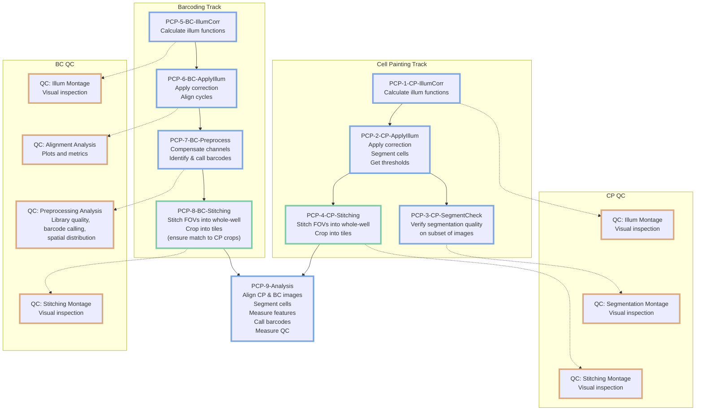

# PCPIP Docker Demo

Containerized PCPIP (Pooled Cell Painting Image Processing) pipeline demo using CellProfiler and Fiji.

## Pipeline Architecture

This pipeline uses three specialized Docker containers:

- **cellprofiler**: Runs CellProfiler pipelines (1-3, 5-7, 9)
- **fiji**: Runs ImageJ/Fiji stitching (4, 8)
- **qc**: Runs QC analysis (montages and notebooks)

Each container is called with `PIPELINE_STEP` to specify what to run.

## Quick Start

### Prerequisites

- Docker Desktop (macOS/Windows) or Podman (Linux) with **16GB memory** for Pipeline 9
- Git installed
- [uv](https://docs.astral.sh/uv/) for running Python scripts
- Optional: [Pixi](https://pixi.sh) for running QC scripts locally

### Test Data Fixtures

Multiple test datasets are available in S3. Choose the fixture that matches your testing needs:

| Fixture | Description | S3 Path |
|---------|-------------|---------|
| **fix-s1** | 3 wells (A1, A2, B1) × 4 sites each | `s3://nf-pooled-cellpainting-sandbox/data/test-data/fix-s1/` |
| **fix-l1** | 1 well (A1) × 1025 sites (full well) | `s3://nf-pooled-cellpainting-sandbox/data/test-data/fix-l1/` |

**To use a different fixture**: Replace the fixture name in step 2 below.

### Setup & Run

```bash
# Run all commands from the pcpip/ directory
cd pcpip/

# 0. Set compose command (use podman-compose on Linux/Podman, docker-compose elsewhere)
COMPOSE_CMD=docker-compose  
# COMPOSE_CMD=podman-compose

# 1. Clone plugins
git clone https://github.com/CellProfiler/CellProfiler-plugins.git plugins/

# 2. Get test data (images + reference files)
# Choose your fixture: fix-s1 (standard), fix-l1 (large)
FIXTURE=fix-s1
aws s3 sync s3://nf-pooled-cellpainting-sandbox/data/test-data/${FIXTURE}/ data/ --no-sign-request

# 3. Generate samplesheet from images (overwrites reference samplesheet from S3)
# Use --wells to filter to specific wells at generation time
# Options: --wells "A1" for single well, or --wells "A1,A2,B1" for multiple wells
uv run scripts/samplesheet_generate.py data/Source1/images/Batch1/images \
  --dataset fix_s1 \
  --output data/Source1/workspace/samplesheets/samplesheet1.csv \
  --batch Batch1 \
  --wells "A1"

# 4. Generate LoadData CSVs from samplesheet
# This creates the CSVs that CellProfiler pipelines will use
uv run scripts/load_data_generate.py data/Source1/workspace/samplesheets/samplesheet1.csv

# 4a. (Optional) Inspect samplesheet statistics
# Note: Edit scripts/samplesheet_inspect.sql to change the CSV path from S3 to local:
# read_csv('data/Source1/workspace/samplesheets/samplesheet1.csv', AUTO_DETECT=TRUE)
duckdb < scripts/samplesheet_inspect.sql

# 5. (Optional) Crop images for faster processing
# Overwrites originals - re-download from S3 to restore
# Options: 25 (fastest), 50 (balanced), 75 (conservative)
# Note: Uses LZW compression which produces different file encodings across runs,
#       but pixel data remains identical (no impact on pipeline reproducibility)
CROP_PERCENT=25 ${COMPOSE_CMD} run --rm cellprofiler python3 /app/scripts/crop_preprocess.py --fixture ${FIXTURE}

# 6. (Podman only) Fix permissions for volume mounts
[ "$COMPOSE_CMD" = "podman-compose" ] && mkdir -p data/logs/ && chmod -R 777 data/Source1/images/Batch1/ data/logs/

# 7. Run complete workflow with QC
# Note: Stitching steps use CROP_PERCENT to adjust tile dimensions - use the same value as above!
PIPELINE_STEP=1 ${COMPOSE_CMD} run --rm cellprofiler
PIPELINE_STEP=1_qc_illum ${COMPOSE_CMD} run --rm qc
PIPELINE_STEP="2,3" ${COMPOSE_CMD} run --rm cellprofiler
PIPELINE_STEP=3_qc_seg ${COMPOSE_CMD} run --rm qc

# (Podman only) Fix permissions for volume mounts
[ "$COMPOSE_CMD" = "podman-compose" ] && sudo chmod -R 777 data/Source1/images/

CROP_PERCENT=25 PIPELINE_STEP=4 ${COMPOSE_CMD} run --rm fiji
PIPELINE_STEP=4_qc_stitch ${COMPOSE_CMD} run --rm qc

PIPELINE_STEP=5 ${COMPOSE_CMD} run --rm cellprofiler
PIPELINE_STEP=5_qc_illum ${COMPOSE_CMD} run --rm qc
PIPELINE_STEP="6,7" ${COMPOSE_CMD} run --rm cellprofiler
PIPELINE_STEP=6_qc_align ${COMPOSE_CMD} run --rm qc
PIPELINE_STEP=7_qc_preprocess ${COMPOSE_CMD} run --rm qc

# (Podman only) Fix permissions for volume mounts
[ "$COMPOSE_CMD" = "podman-compose" ] && sudo chmod -R 777 data/Source1/images/

CROP_PERCENT=25 PIPELINE_STEP=8 ${COMPOSE_CMD} run --rm fiji
PIPELINE_STEP=8_qc_stitch ${COMPOSE_CMD} run --rm qc

PIPELINE_STEP=9 ${COMPOSE_CMD} run --rm cellprofiler
```

### Pipeline Details



## Reference

### Directory Structure

```text
pcpip/
├── pipelines/                             # Demo pipeline files for test fixtures
├── pipelines-datasets/                    # Production dataset pipelines (cpg0032, etc.)
├── plugins/                               # CellProfiler plugins (cloned separately)
├── scripts/                               # Processing scripts and utilities
│   ├── run_pcpip.sh                       # Main pipeline orchestration script
│   ├── samplesheet_generate.py            # Generate samplesheet from raw images
│   ├── load_data_generate.py              # Generate LoadData CSVs from samplesheet
│   ├── stitch_crop.py                     # ImageJ/Fiji stitching and cropping
│   ├── crop_preprocess.py                 # Crop images for faster testing
│   ├── montage.py                         # QC visualization montages
│   └── archive/                           # Legacy scripts for reference CSV maintenance
├── data/                                  # Unified data directory
│   └── Source1/images/Batch1/
│       ├── illum/                         # Illumination correction functions
│       ├── images_corrected/              # Corrected images
│       ├── images_aligned/                # Aligned barcoding images
│       ├── images_corrected_stitched/     # Stitched whole-well images
│       ├── images_corrected_cropped/      # Cropped tile images
│       └── qc_reports/                    # QC visualization outputs
└── docker-compose.yml                     # Container configuration
```

### Quality Control (QC)

The pipeline currently includes visual QC via montage generation at key processing steps.

#### Available QC Steps

- **1_qc_illum**: Montage: painting illumination corrections after Pipeline 1
- **5_qc_illum**: Montage: barcoding illumination corrections after Pipeline 5
- **3_qc_seg**: Montage: segmentation check images after Pipeline 3
- **4_qc_stitch**: Montage: painting stitched whole-well images (10X previews) after Pipeline 4
- **8_qc_stitch**: Montage: barcoding stitched whole-well images (10X previews) after Pipeline 8
- **6_qc_align**: Notebook: Barcode alignment analysis after Pipeline 6
- **7_qc_preprocess**: Notebook: Barcode preprocessing analysis after Pipeline 7

#### Running QC Steps

```bash
# Run visual QC montages via Docker/Podman
PIPELINE_STEP=1_qc_illum ${COMPOSE_CMD} run --rm qc
PIPELINE_STEP=3_qc_seg ${COMPOSE_CMD} run --rm qc
PIPELINE_STEP=4_qc_stitch ${COMPOSE_CMD} run --rm qc
PIPELINE_STEP=5_qc_illum ${COMPOSE_CMD} run --rm qc
PIPELINE_STEP=6_qc_align ${COMPOSE_CMD} run --rm qc
PIPELINE_STEP=7_qc_preprocess ${COMPOSE_CMD} run --rm qc
PIPELINE_STEP=8_qc_stitch ${COMPOSE_CMD} run --rm qc

# === Local execution with Pixi (for interactive/custom use) ===
# For montage usage examples and pattern reference, see: scripts/montage.py docstring

# Example: Alignment QC - Execute notebook with Papermill
pixi exec -c conda-forge \
  --spec python=3.13 \
  --spec pandas=2.3.3 \
  --spec seaborn=0.13.2 \
  --spec matplotlib=3.10.0 \
  --spec papermill=2.6.0 \
  --spec jupytext=1.16.4 \
  --spec ipykernel=6.29.5 \
  --spec nbconvert=7.16.4 \
  --spec pyarrow=22.0.0 -- \
bash -c '
  OUTPUT_DIR="data/Source1/workspace/qc_reports/6_alignment/Plate1"
  mkdir -p $OUTPUT_DIR
  # Convert .py to .ipynb, then execute with papermill
  jupytext --to ipynb notebooks/qc_barcode_align.py -o /tmp/qc_barcode_align.ipynb
  papermill /tmp/qc_barcode_align.ipynb $OUTPUT_DIR/alignment_analysis.ipynb \
    -p input_dir "$(pwd)/data/Source1/images/Batch1/images_aligned/barcoding/Plate1" \
    -p output_dir "$(pwd)/$OUTPUT_DIR" \
    -p numcycles 3 \
    -p shift_threshold 50.0 \
    -p corr_threshold 0.9 \
    -p rows 2 \
    -p columns 2
  # Convert to HTML for browser viewing
  jupyter nbconvert $OUTPUT_DIR/alignment_analysis.ipynb --to html
'

# Example: Barcode Preprocessing QC - Execute notebook with Papermill
pixi exec -c conda-forge \
  --spec python=3.13 \
  --spec pandas=2.3.3 \
  --spec seaborn=0.13.2 \
  --spec matplotlib=3.10.0 \
  --spec papermill=2.6.0 \
  --spec jupytext=1.16.4 \
  --spec ipykernel=6.29.5 \
  --spec nbconvert=7.16.4 \
  --spec pyarrow=22.0.0 -- \
bash -c '
  OUTPUT_DIR="data/Source1/workspace/qc_reports/7_preprocessing/Plate1"
  mkdir -p $OUTPUT_DIR
  # Convert .py to .ipynb, then execute with papermill
  jupytext --to ipynb notebooks/qc_barcode_preprocess.py -o /tmp/qc_barcode_preprocess.ipynb
  papermill /tmp/qc_barcode_preprocess.ipynb $OUTPUT_DIR/preprocessing_analysis.ipynb \
    -p input_dir "$(pwd)/data/Source1/images/Batch1/images_corrected/barcoding/Plate1" \
    -p output_dir "$(pwd)/$OUTPUT_DIR" \
    -p barcode_library_path "$(pwd)/data/Source1/workspace/metadata/Barcodes.csv" \
    -p numcycles 3 \
    -p rows 2 \
    -p columns 2
  # Convert to HTML for browser viewing
  jupyter nbconvert $OUTPUT_DIR/preprocessing_analysis.ipynb --to html
'

# Note: QC notebooks cache data as parquet files for fast interactive re-runs.
# Production runs via Docker always regenerate fresh data (use_cache=false in `run_pcpip.sh`).
```

### Troubleshooting

#### Pipeline 9 Memory Issues

- Requires Docker Desktop with 16GB+ memory allocation
- If still failing, increase to 24GB or 32GB

#### Debug Commands

```bash
# Check logs
ls data/logs/*/
tail data/logs/*/pipeline*.log

# Interactive shells
${COMPOSE_CMD} run --rm cellprofiler-shell
${COMPOSE_CMD} run --rm fiji-shell

# Cleanup outputs
rm -rf data/Source1/images/Batch1/{illum,images_aligned,images_corrected*}
```

```bash
# Test single well stitching and cropping
${COMPOSE_CMD} run --rm \
  -e STITCH_INPUT_BASE="/app/data/Source1/images/Batch1" \
  -e STITCH_TRACK_TYPE="painting" \
  -e STITCH_OUTPUT_TAG="Plate1-A1" \
  -e STITCH_AUTORUN="true" \
  fiji /opt/fiji/Fiji.app/ImageJ-linux64 --ij2 --headless --run /app/scripts/stitch_crop.py

# Expected outputs per channel (3 channels × 3 output types, Nov 2025 naming):
# - images_corrected_stitched/painting/Plate1/Plate1-A1/Plate1-A1-Corr{CHANNEL}-Stitched.tiff (1600×1600)
# - images_corrected_cropped/painting/Plate1/Plate1-A1/Plate_Plate1_Well_A1_Site_{1-4}_Corr{CHANNEL}.tiff (800×800)
# - images_corrected_stitched_10X/painting/Plate1/Plate1-A1/Plate1-A1-Corr{CHANNEL}-Stitched.tiff (160×160)
```

### Maintainer Notes

#### Creating a container

Go to <https://seqera.io/containers/>, use only `conda-forge` as the source (on the left), and select the packages you need

For example, building it out like this (the page will take a minute to fully load) <https://seqera.io/containers/?packages=conda-forge::pandas=2.3.3+conda-forge::pip=25.2+conda-forge::pyarrow=22.0.0+conda-forge::seaborn=0.13.2+conda-forge::pillow=12.0.0+conda-forge::ipykernel=7.1.0+conda-forge::papermill=2.6.0+conda-forge::python=3.13.9+conda-forge::jupytext=1.18.1+conda-forge::nbconvert=7.16.6> will create the image `community.wave.seqera.io/library/ipykernel_jupytext_nbconvert_pandas_pruned:c397cee54f4ab064`, with the build page <https://wave.seqera.io/view/builds/bd-c397cee54f4ab064_1>

- Use Python <3.14 because of some compatibility issues.
- `jupytext` defaults to `master`; use the latest version instead.

#### Generating Samplesheets from S3 Datasets

To create a samplesheet directly from an S3 dataset (e.g., cpg0032):

```bash
# Generate samplesheet from S3 (no download required)
mkdir -p /tmp/pcpip-samplesheets
uv run scripts/samplesheet_generate.py \
  s3://cellpainting-gallery/cpg0032-pooled-rare/broad/images/2025_06_23_Batch3/images/Plate_A/ \
  --dataset cpg0032 \
  --output /tmp/pcpip-samplesheets/samplesheet_cpg0032_batch3_plateA.csv \
  --batch Batch3 \
  --wells "A1,A2" \
  --no-sign-request

# Upload to S3 reference location
aws s3 cp /tmp/pcpip-samplesheets/samplesheet_cpg0032_batch3_plateA.csv \
  s3://nf-pooled-cellpainting-sandbox/data/test-data/cpg0032-output/Source1/workspace/samplesheets/samplesheet1.csv \
  --profile cslab
```

#### Downloading Production Dataset Pipelines

For production datasets (cpg0032, etc.), download dataset-specific pipelines to `pipelines-datasets/`. See [pipelines-datasets/README.md](pipelines-datasets/README.md) for download commands.

#### Building Fusion-Compatible Fiji Image

To rebuild `cellprofiler/distributed-fiji:fusion` with `ENTRYPOINT []` for Nextflow Fusion compatibility:

```bash
# Create Dockerfile
cat > Dockerfile.fiji-fusion <<'EOF'
FROM cellprofiler/distributed-fiji@sha256:44dbc2ddb34260e7883980dc6719dfb73babb2e158c11b106c94c0192dad5e95
ENTRYPOINT []
EOF

# Build and push
docker buildx build --platform linux/amd64 \
  -f Dockerfile.fiji-fusion \
  -t cellprofiler/distributed-fiji:fusion \
  -t cellprofiler/distributed-fiji:fusion-v0.1.0 \
  --push .
```

**Note:** Use `docker buildx build --platform linux/amd64 --push` to ensure correct architecture when building from ARM hosts.

#### Creating and Uploading Cropped Input Datasets

To create a pre-cropped input dataset for faster testing:

```bash
# Set your fixture
FIXTURE=fix-s1  # or fix-l1

# Step 1: Download original input data to a temp location (NOT the working data/ directory)
mkdir -p /tmp/pcpip-input
aws s3 sync s3://nf-pooled-cellpainting-sandbox/data/test-data/${FIXTURE}/ /tmp/pcpip-input/ \
  --no-sign-request

# Step 2: Run cropping to create a 25% size version
${COMPOSE_CMD} run --rm \
  -e CROP_PERCENT=25 \
  -v /tmp/pcpip-input:/input \
  cellprofiler-shell \
  python /app/scripts/crop_preprocess.py \
    --input_dir /input/Source1/images/Batch1/images \
    --fixture ${FIXTURE}

# Step 3: Upload cropped INPUT dataset to S3 (as a new input dataset, not output)

# Set your AWS profile (if needed)
export AWS_PROFILE=your-profile-name  # Or configure AWS credentials as appropriate

aws s3 sync /tmp/pcpip-input/ s3://nf-pooled-cellpainting-sandbox/data/test-data/${FIXTURE}_sub25/ \
  --size-only

# Step 4: Clean up temp directories
rm -rf /tmp/pcpip-input
```

Users can then switch between full and cropped input datasets by changing the dataset path in their configuration from `${FIXTURE}/` to `${FIXTURE}_sub25/`.

#### Uploading Results to S3

To share pipeline outputs for reproducibility:

```bash
# Set your fixture and AWS profile
export FIXTURE=fix-s1  
# export FIXTURE=fix-l1
export AWS_PROFILE=your-profile-name  # Or configure AWS credentials as appropriate

# Step 1: Upload data (excluding logs)
# Add `--delete` flag to remove S3 files not present locally, BUT USE WITH CAUTION!
aws s3 sync data/ s3://nf-pooled-cellpainting-sandbox/data/test-data/${FIXTURE}-output/ \
  --size-only \
  --no-follow-symlinks \
  --exclude "logs/*" \
  --exclude "*.tmp" \
  --exclude ".DS_Store"

# Step 2: Clean up logs first! Remove iteration/test runs, keep only final pipeline runs
rm -rf data/logs/2025-*-test/  # Example: remove test directories
# Then sync logs separately
aws s3 sync data/logs/ s3://nf-pooled-cellpainting-sandbox/data/test-data/${FIXTURE}-output/logs/ \
  --size-only
```

**Warning**: Clean logs directory before syncing - it accumulates junk from iterations. Only upload final, relevant pipeline logs.
**Note**: Uses `--size-only` to avoid re-uploading unchanged files (compares size only, not timestamps).

#### Comparing Local Outputs with S3

To verify local pipeline outputs match the reference outputs on S3:

**Note on Stitching Non-Determinism**: Fiji stitching (steps 4/8) appears to produce non-deterministic results. Based on experiments running the same inputs multiple times (Nov 2025):

- The Grid/Collection stitching algorithm with `compute_overlap` converges to different tile positions across runs
- Even with identical tile positions, pixel blending produces different output values
- ~0.01% of pixels differ with intensity variations up to 600 units (on uint16 scale)
- Every run produces a unique output, even from byte-identical inputs

Consequently, **perfect reproducibility is not currently possible** for stitched images (steps 4/8), cropped tiles, or Pipeline 9 analysis outputs. The root cause is unclear but may involve floating-point computation order or iterative optimization in the stitching algorithm. CellProfiler steps (1-3, 5-7) remain deterministic and should match exactly.

**Note on LZW Compression**: If `crop_preprocess.py` was used, input images will show MD5 differences due to non-deterministic LZW compression encoding, but pixel data remains identical with no impact on pipeline outputs.

```bash
# Set your fixture
export FIXTURE=fix-s1
# export FIXTURE=fix-l1


# Compare Batch1 outputs (excluding temporary files and CellProfiler CSVs)
pixi exec --spec rclone -- rclone check \
  data/Source1/images/Batch1 \
  :s3,provider=AWS,region=us-east-1:nf-pooled-cellpainting-sandbox/data/test-data/${FIXTURE}-output/Source1/images/Batch1 \
  --skip-links \
  --exclude "*_Image.csv" \
  --exclude "*_Experiment.csv" \
  --exclude ".DS_Store" \
  --exclude "*.tmp"

# Compare analysis outputs separately
pixi exec --spec rclone -- rclone check \
  data/Source1/workspace/analysis \
  :s3,provider=AWS,region=us-east-1:nf-pooled-cellpainting-sandbox/data/test-data/${FIXTURE}-output/Source1/workspace/analysis \
  --skip-links \
  --exclude "Image.csv" \
  --exclude "Experiment.csv" \
  --exclude ".DS_Store" \
  --exclude "*.tmp"
```

**Note**:

- Uses rclone's on-the-fly S3 config (`:s3,provider=AWS,region=us-east-1:`) for public bucket access
- Excludes CellProfiler experiment CSVs which contain timestamps/metadata that vary between runs
- The `--skip-links` flag ignores symbolic links
