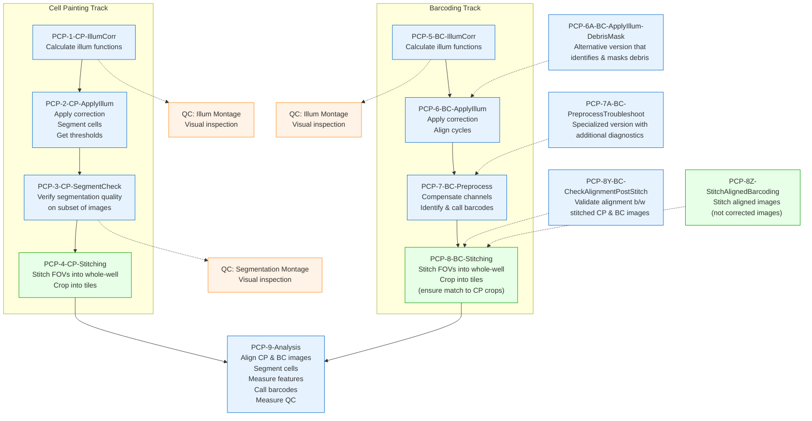

# PCPIP Docker Demo

Containerized PCPIP (Pooled Cell Painting Image Processing) pipeline demo using CellProfiler and Fiji.

## Pipeline Architecture

This pipeline uses three specialized Docker containers:

- **cellprofiler**: Runs CellProfiler pipelines (1-3, 5-7, 9)
- **fiji**: Runs ImageJ/Fiji stitching (4, 8)
- **qc**: Runs QC visualizations with Pixi (1_qc_illum, 5_qc_illum)

Each container is called with `PIPELINE_STEP` to specify what to run.

## Quick Start

### Prerequisites

- Docker Desktop (macOS/Windows) or Podman (Linux) with **16GB memory** for Pipeline 9
- Git installed
- [uv](https://docs.astral.sh/uv/) for running Python scripts
- Optional: [Pixi](https://pixi.sh) for running QC scripts locally

### Test Data Fixtures

Multiple test datasets are available in S3. Choose the fixture that matches your testing needs:

| Fixture | Description | S3 Path |
|---------|-------------|---------|
| **fix-s1** | 3 wells (A1, A2, B1) × 4 sites each | `s3://nf-pooled-cellpainting-sandbox/data/test-data/fix-s1/` |
| **fix-l1** | 1 well (A1) × 1025 sites (full well) | `s3://nf-pooled-cellpainting-sandbox/data/test-data/fix-l1/` |

**To use a different fixture**: Replace the fixture name in step 2 below.

### Setup & Run

```bash
# Run all commands from the pcpip/ directory
cd pcpip/

# 0. Set compose command (use podman-compose on Linux/Podman, docker-compose elsewhere)
COMPOSE_CMD=docker-compose  # or: COMPOSE_CMD=podman-compose

# 1. Clone plugins
git clone https://github.com/CellProfiler/CellProfiler-plugins.git plugins/

# 2. Get test data (images + reference files)
# Choose your fixture: fix-s1 (standard), fix-l1 (large)
FIXTURE=fix-s1
aws s3 sync s3://nf-pooled-cellpainting-sandbox/data/test-data/${FIXTURE}/ data/ --no-sign-request

# 3. Generate samplesheet from images (overwrites reference samplesheet from S3)
# Use --wells to filter to specific wells at generation time
# Options: --wells "A1" for single well, or --wells "A1,A2,B1" for multiple wells
uv run scripts/samplesheet_generate.py data/Source1/images/Batch1/images \
  --output data/Source1/workspace/samplesheets/samplesheet1.csv \
  --batch Batch1 \
  --wells "A1"

# 4. Generate LoadData CSVs from samplesheet
# This creates the CSVs that CellProfiler pipelines will use
uv run scripts/load_data_generate.py data/Source1/workspace/samplesheets/samplesheet1.csv

# 5. (Optional) Crop images for faster processing
# Overwrites originals - re-download from S3 to restore
# Options: 25 (fastest), 50 (balanced), 75 (conservative)
CROP_PERCENT=25 ${COMPOSE_CMD} run --rm cellprofiler python3 /app/scripts/crop_preprocess.py --fixture ${FIXTURE}

# 6. (Podman only) Fix permissions for volume mounts
[ "$COMPOSE_CMD" = "podman-compose" ] && chmod -R 777 data/Source1/images/Batch1/ data/logs/

# 7. Run complete workflow with QC
# Note: Stitching steps use CROP_PERCENT to adjust tile dimensions - use the same value as above!
PIPELINE_STEP=1 ${COMPOSE_CMD} run --rm cellprofiler
PIPELINE_STEP=1_qc_illum ${COMPOSE_CMD} run --rm qc
PIPELINE_STEP="2,3" ${COMPOSE_CMD} run --rm cellprofiler
PIPELINE_STEP=3_qc_seg ${COMPOSE_CMD} run --rm qc
CROP_PERCENT=25 PIPELINE_STEP=4 ${COMPOSE_CMD} run --rm fiji

PIPELINE_STEP=5 ${COMPOSE_CMD} run --rm cellprofiler
PIPELINE_STEP=5_qc_illum ${COMPOSE_CMD} run --rm qc
PIPELINE_STEP="6,7" ${COMPOSE_CMD} run --rm cellprofiler
CROP_PERCENT=25 PIPELINE_STEP=8 ${COMPOSE_CMD} run --rm fiji

PIPELINE_STEP=9 ${COMPOSE_CMD} run --rm cellprofiler
```

<details>
<summary>Pipeline Details</summary>



</details>

## Reference

### Directory Structure

```
pcpip/
├── pipelines/                             # CellProfiler pipeline files (.cppipe)
├── plugins/                               # CellProfiler plugins (cloned separately)
├── scripts/                               # Processing scripts and utilities
│   ├── run_pcpip.sh                       # Main pipeline orchestration script
│   ├── samplesheet_generate.py            # Generate samplesheet from raw images
│   ├── load_data_generate.py              # Generate LoadData CSVs from samplesheet
│   ├── stitch_crop.py                     # ImageJ/Fiji stitching and cropping
│   ├── crop_preprocess.py                 # Crop images for faster testing
│   ├── montage.py                         # QC visualization montages
│   └── archive/                           # Legacy scripts for reference CSV maintenance
│       ├── load_data_filter.py            # Filter LoadData CSVs (superseded by samplesheet_generate.py --wells)
│       ├── load_data_check.py             # Validate LoadData CSV file paths exist
│       ├── load_data_transform_p3.py      # Transform pipeline 3 CSVs
│       ├── load_data_transform_p7.py      # Transform pipeline 7 CSVs
│       └── load_data_transform_p9.py      # Transform pipeline 9 CSVs
├── data/                                  # Unified data directory
│   └── Source1/images/Batch1/
│       ├── illum/                         # Illumination correction functions
│       ├── images_corrected/              # Corrected images
│       ├── images_aligned/                # Aligned barcoding images
│       ├── images_corrected_stitched/     # Stitched whole-well images
│       ├── images_corrected_cropped/      # Cropped tile images
│       └── qc_reports/                    # QC visualization outputs
└── docker-compose.yml                     # Container configuration
```

### Quality Control (QC)

The pipeline currently includes visual QC via montage generation at key processing steps.

#### Available QC Steps

QC currently consists of creating visual montages using the `montage.py` script:

- **1_qc_illum**: Montage of cell painting illumination corrections after Pipeline 1
- **3_qc_seg**: Montage of segmentation check images after Pipeline 3
- **5_qc_illum**: Montage of barcoding illumination corrections after Pipeline 5

#### Running QC Steps

```bash
# Run QC montages via Docker/Podman
PIPELINE_STEP=1_qc_illum ${COMPOSE_CMD} run --rm qc
PIPELINE_STEP=3_qc_seg ${COMPOSE_CMD} run --rm qc
PIPELINE_STEP=5_qc_illum ${COMPOSE_CMD} run --rm qc

# Run montage script locally with Pixi
pixi exec -c conda-forge --spec python=3.13 --spec numpy=2.3.3 --spec pillow=11.3.0 -- \
  python scripts/montage.py \
  data/Source1/images/Batch1/illum/Plate1 \
  output_montage.png \
  --pattern ".*\\.npy$"
```

### Troubleshooting

#### Pipeline 9 Memory Issues

- Requires Docker Desktop with 16GB+ memory allocation
- If still failing, increase to 24GB or 32GB

#### Debug Commands

```bash
# Check logs
ls data/logs/*/
tail data/logs/*/pipeline*.log

# Interactive shells
${COMPOSE_CMD} run --rm cellprofiler-shell
${COMPOSE_CMD} run --rm fiji-shell

# Cleanup outputs
rm -rf data/Source1/images/Batch1/{illum,images_aligned,images_corrected*}
```

```bash
# Test single well stitching and cropping
${COMPOSE_CMD} run --rm \
  -e STITCH_INPUT_BASE="/app/data/Source1/images/Batch1" \
  -e STITCH_TRACK_TYPE="painting" \
  -e STITCH_OUTPUT_TAG="Plate1-A1" \
  -e STITCH_AUTORUN="true" \
  fiji /opt/fiji/Fiji.app/ImageJ-linux64 --ij2 --headless --run /app/scripts/stitch_crop.py

# Expected outputs per channel (3 channels × 3 output types = 9 files per channel):
# - images_corrected_stitched/painting/Plate1/Plate1-A1/Stitched_Corr{CHANNEL}.tiff (1600×1600)
# - images_corrected_cropped/painting/Plate1/Plate1-A1/Corr{CHANNEL}/Corr{CHANNEL}_Site_{1-4}.tiff (800×800)
# - images_corrected_stitched_10X/painting/Plate1/Plate1-A1/Stitched_Corr{CHANNEL}.tiff (160×160)
```

### Maintainer Notes

#### Validating Generated CSVs

Reference LoadData CSVs exist in S3 fixtures as validation artifacts. These can be used to verify that generated CSVs are correct:

```bash
# Download fixture with reference CSVs
FIXTURE=fix-s1
aws s3 sync s3://nf-pooled-cellpainting-sandbox/data/test-data/${FIXTURE}/ data/ --no-sign-request

# Generate samplesheet and LoadData CSVs as usual
uv run scripts/samplesheet_generate.py data/Source1/images/Batch1/images \
  --output data/Source1/workspace/samplesheets/samplesheet1.csv \
  --wells "A1"

# Validate generated CSVs against reference CSVs
uv run scripts/load_data_generate.py data/Source1/workspace/samplesheets/samplesheet1.csv --validate

# The --validate flag compares generated CSVs against reference files and reports matches/differences
```

**Note**: Reference CSVs are validation artifacts, not used by the pipeline itself. The pipeline always uses freshly generated CSVs.

#### Creating and Uploading Cropped Input Datasets

To create a pre-cropped input dataset for faster testing:

```bash
# Set your fixture
FIXTURE=fix-s1  # or fix-l1

# Step 1: Download original input data to a temp location (NOT the working data/ directory)
mkdir -p /tmp/pcpip-input
aws s3 sync s3://nf-pooled-cellpainting-sandbox/data/test-data/${FIXTURE}/ /tmp/pcpip-input/ \
  --no-sign-request

# Step 2: Run cropping to create a 25% size version
${COMPOSE_CMD} run --rm \
  -e CROP_PERCENT=25 \
  -v /tmp/pcpip-input:/input \
  cellprofiler-shell \
  python /app/scripts/crop_preprocess.py \
    --input_dir /input/Source1/images/Batch1/images \
    --fixture ${FIXTURE}

# Step 3: Upload cropped INPUT dataset to S3 (as a new input dataset, not output)

# Set your AWS profile (if needed)
export AWS_PROFILE=your-profile-name  # Or configure AWS credentials as appropriate

aws s3 sync /tmp/pcpip-input/ s3://nf-pooled-cellpainting-sandbox/data/test-data/${FIXTURE}_sub25/ \
  --size-only

# Step 4: Clean up temp directories
rm -rf /tmp/pcpip-input
```

Users can then switch between full and cropped input datasets by changing the dataset path in their configuration from `${FIXTURE}/` to `${FIXTURE}_sub25/`.

#### Uploading Results to S3

To share pipeline outputs for reproducibility:

```bash
# Set your fixture and AWS profile
export FIXTURE=fix-s1  # or fix-l1
export AWS_PROFILE=your-profile-name  # Or configure AWS credentials as appropriate

# Step 1: Upload data (excluding logs)
# Add `--delete` flag to remove S3 files not present locally, BUT USE WITH CAUTION!
aws s3 sync data/ s3://nf-pooled-cellpainting-sandbox/data/test-data/${FIXTURE}-output/ \
  --size-only \
  --no-follow-symlinks \
  --exclude "logs/*" \
  --exclude "*.tmp" \
  --exclude ".DS_Store"

# Step 2: Clean up logs first! Remove iteration/test runs, keep only final pipeline runs
rm -rf data/logs/2025-*-test/  # Example: remove test directories
# Then sync logs separately
aws s3 sync data/logs/ s3://nf-pooled-cellpainting-sandbox/data/test-data/${FIXTURE}-output/logs/ \
  --size-only
```

**Warning**: Clean logs directory before syncing - it accumulates junk from iterations. Only upload final, relevant pipeline logs.
**Note**: Uses `--size-only` to avoid re-uploading unchanged files (compares size only, not timestamps).

#### Comparing Local Outputs with S3

To verify local pipeline outputs match the reference outputs on S3:

**Note**: Fiji stitching (steps 4/8) may produce non-deterministic results (~1-2% of pixels with minor intensity differences). This is speculative but based on observed behavior. Consequently, all downstream outputs (stitched images, cropped tiles, and Pipeline 9 analysis) may differ slightly from S3 reference outputs even when inputs are identical. CellProfiler steps (1-3, 5-7) should match exactly.

```bash
# Set your fixture
FIXTURE=fix-s1  # or fix-l1

# Compare Batch1 outputs (excluding temporary files and CellProfiler CSVs)
pixi exec --spec rclone -- rclone check \
  data/Source1/images/Batch1 \
  :s3,provider=AWS,region=us-east-1:nf-pooled-cellpainting-sandbox/data/test-data/${FIXTURE}-output/Source1/images/Batch1 \
  --skip-links \
  --exclude "*_Image.csv" \
  --exclude "*_Experiment.csv" \
  --exclude ".DS_Store" \
  --exclude "*.tmp"

# Compare analysis outputs separately
pixi exec --spec rclone -- rclone check \
  data/Source1/workspace/analysis \
  :s3,provider=AWS,region=us-east-1:nf-pooled-cellpainting-sandbox/data/test-data/${FIXTURE}-output/Source1/workspace/analysis \
  --skip-links \
  --exclude "Image.csv" \
  --exclude "Experiment.csv" \
  --exclude ".DS_Store" \
  --exclude "*.tmp"
```

**Note**:

- Uses rclone's on-the-fly S3 config (`:s3,provider=AWS,region=us-east-1:`) for public bucket access
- Excludes CellProfiler experiment CSVs which contain timestamps/metadata that vary between runs
- The `--skip-links` flag ignores symbolic links

---

### Legacy: Reference CSV Maintenance

**Note**: This section documents legacy workflows for maintaining reference LoadData CSVs in S3 fixtures. These are only needed when updating S3 reference artifacts. Standard pipeline workflows do not use these scripts.

#### CSV Transformation Scripts

These scripts update the load_data CSV files to match the pipeline's output folder structure. After running these transformations, sync the updated files back to S3.

```bash
# Set your base directory
BASE_DIR="data/Source1/workspace/load_data_csv/Batch1/Plate1_trimmed"

# Function to safely run Python transformations in-place
transform_csv() {
    local pipeline_num=$1
    uv run scripts/archive/load_data_transform_p${pipeline_num}.py \
        ${BASE_DIR}/load_data_pipeline${pipeline_num}_revised.csv \
        ${BASE_DIR}/load_data_pipeline${pipeline_num}_revised.tmp
    mv ${BASE_DIR}/load_data_pipeline${pipeline_num}_revised.tmp \
        ${BASE_DIR}/load_data_pipeline${pipeline_num}_revised.csv
}

# Step 1: Apply sed to ALL original CSVs to create _revised versions
for csv in ${BASE_DIR}/load_data_pipeline*.csv; do
    if [[ ! "$csv" =~ _revised\.csv$ ]]; then
        sed 's,Source1/Batch1,Source1/images/Batch1,g' "$csv" > "${csv%.csv}_revised.csv"
    fi
done

# Step 2: Run Python transformations in-place on the _revised files
transform_csv 3
transform_csv 7
transform_csv 9

# Sync updated CSVs back to S3
aws s3 sync data/Source1/workspace/load_data_csv/ s3://nf-pooled-cellpainting-sandbox/data/test-data/fix-s1/Source1/workspace/load_data_csv/ \
  --exclude "*" \
  --include "*_revised.csv"
```

#### File Existence Validation Scripts

These scripts validate that files referenced in LoadData CSVs exist. Read-only, doesn't modify files.

```bash
# Validate files exist for input to Pipeline 9 (check for Well A1)
# Run this after running Pipelines 1-8 to verify outputs before Pipeline 9
BASE_DIR="data/Source1/workspace/load_data_csv/Batch1/Plate1_trimmed"
duckdb -c "COPY (SELECT * FROM read_csv_auto('${BASE_DIR}/load_data_pipeline9_revised.csv') WHERE Metadata_Well = 'A1') TO '/tmp/load_data_pipeline9_revised_A1.csv' (FORMAT CSV, HEADER);"
uv run scripts/archive/load_data_check.py /tmp/load_data_pipeline9_revised_A1.csv
# Expected output: Total: 64, Found: 64, Missing: 0

# Check any CSV for file existence
uv run scripts/archive/load_data_check.py ${BASE_DIR}/load_data_pipeline3_revised.csv
uv run scripts/archive/load_data_check.py ${BASE_DIR}/load_data_pipeline7_revised.csv
```
